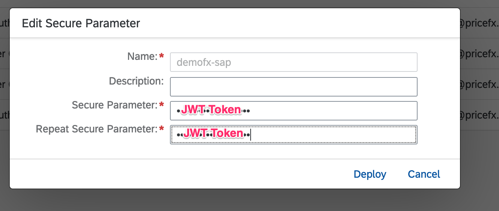
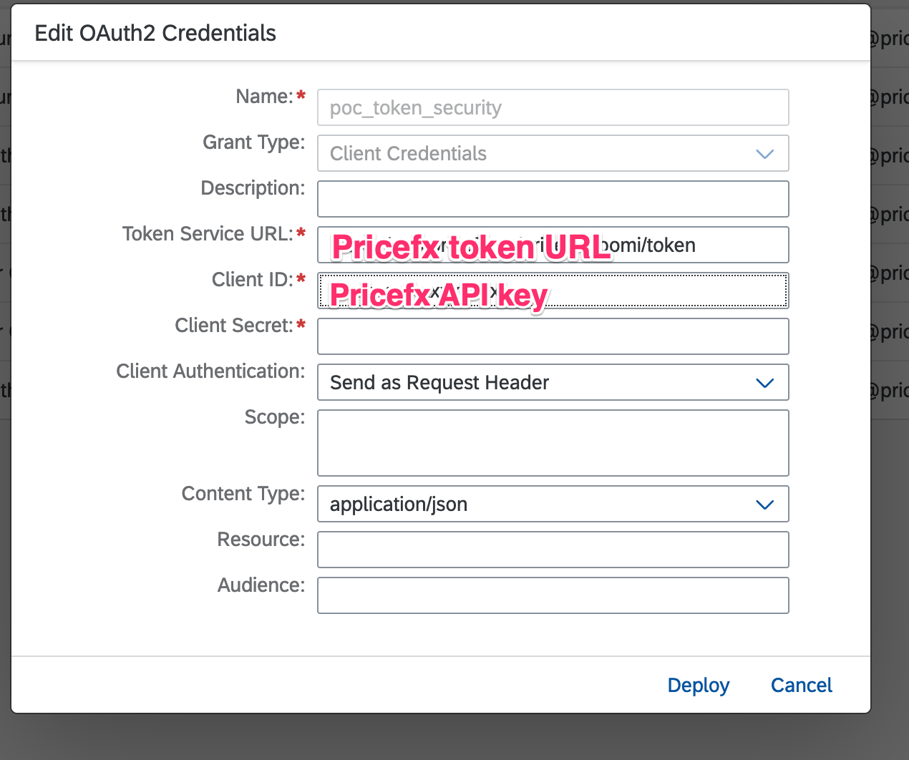
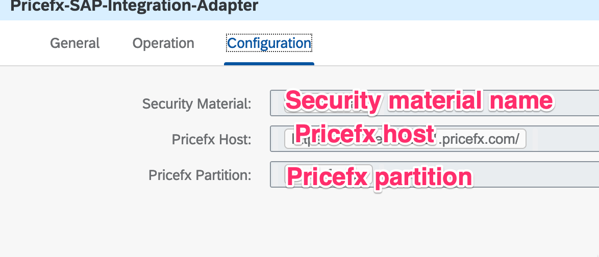
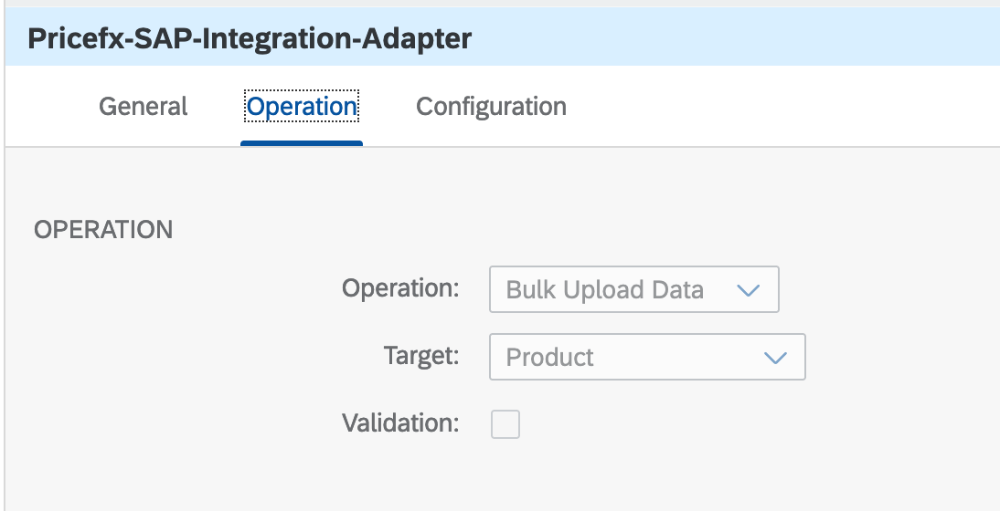
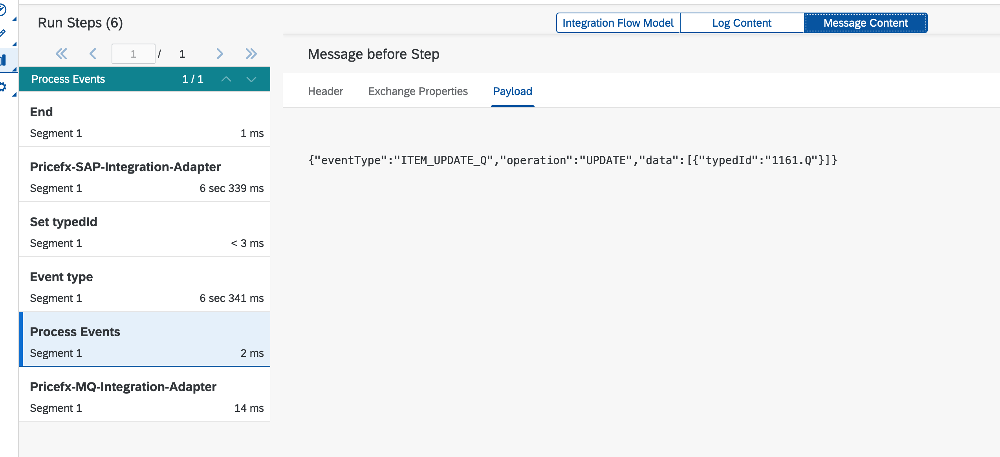

# Build Pricefx integration adapter and Pricefx RabbitMQ integration adapter

\| [Recipes by Topic](../../readme.md ) \| [Recipes by Author](../../author.md ) \| [Request Enhancement](https://github.com/SAP/apibusinesshub-integration-recipes/issues/new?assignees=&labels=Recipe%20Fix,enhancement&template=recipe-request.md&title=Improve%20Pricefx-integration-adapter%20 ) \| [Report a bug](https://github.com/SAP/apibusinesshub-integration-recipes/issues/new?assignees=&labels=Recipe%20Fix,bug&template=bug_report.md&title=Issue%20with%20Pricefx-integration-adapter%20 ) \| [Fix documentation](https://github.com/SAP/apibusinesshub-integration-recipes/issues/new?assignees=&labels=Recipe%20Fix,documentation&template=bug_report.md&title=Docu%20fix%20Pricefx-integration-adapter%20 ) \|

 | [Mandy Siu](https://github.com/mandy-siu ) |
----|--------------------------------------------|

Pricefx is a cloud-native platform supporting the entire pricing journey, from setting optimal prices and managing the rebate process to maximizing your organization's pricing power. 

RabbitMQ is a popular open source message broker and Pricefx makes use of it to communicate with Integration Suite. 

These two integration adapters enable integration flows to connect to Pricefx so that Pricefx can integrate seamlessly with SAP applications.
Integration flows can listen to Pricefx events via Pricefx RabbitMQ integration adapter and to perform any actions to Pricefx via Pricefx Integration Adapter.

[Download the integration flow sample](IntegrationFlow/Pricefx Integration Adapter Samples.zip)\

[Instructions to build the adapter](../../build-deploy-camel-community-adapters.md)

## References
* [Pricefx official site](https://www.pricefx.com/)
* [Pricefx official documentation](https://knowledge.pricefx.com/)
* [Pricefx integration adapter documentation](https://pricefx.atlassian.net/wiki/spaces/ACC/overview/)

## Building the Pricefx integration adapter
pricefx-integration-adapter % mvn clean install -Posgi

## Building the Pricefx RabbitMQ integration adapter
pricefx-sap-rabbitmq-connector % mvn clean install -Posgi

## Sample integration flows
Before running these integration flows, you must set up a Pricefx partition and a security material for authentication.
You could authenticate by either OAuth credentials and OAuth token, or a Secure Parameter with JWT token.

To run RabbitMQ listener integration flow, you need to get the connection details from Pricefx support or project team first.

To see the response message, please deploy the flow and turn on trace mode.

Pricefx Integration Adapter supports more operations than the ones used in the samples. Please refer to Pricefx integration adapter documentation for other operations.

### Pricefx RabbitMQ listener
This integration shows an example on how Pricefx events are consumed.

#### Sample Input
The sample event message can be captured from tracing the message processing log. 
In this example, the integration flow listens to Pricefx events and only quote update events would be processed. Others are discarded.

#### Sample Output
There is no response message in this example.

### Generic Bulk Load Data
This integration shows an example on how records are loaded to Pricefx

#### Sample Input
The sample request message of loading 2 product records is configured in externalized parameter.

#### Sample Output
The response message contains a number > 0 if records are successfully loaded.

### Generic Delete
This integration shows an example on how records are deleted from Pricefx

#### Sample Input
The sample request message of deleting 1 product record is configured in externalized parameter.

#### Sample Output
The response message contains a number > 0 if records are successfully deleted.

### Generic Delete by Key
This integration shows an example on how records are deleted from Pricefx by key

#### Sample Input
The sample request message of deleting 1 product record is configured in externalized parameter.

#### Sample Output
The response message contains a number > 0 if records are successfully deleted.

### Generic Fetch
This integration shows an example on how records are fetched from Pricefx by filter

#### Sample Input
The sample request message of fetching 1 product record is configured in externalized parameter.

#### Sample Output
The response message contains the fetched record

### Generic Get
This integration shows an example on how records are fetched from Pricefx by key

#### Sample Input
There is no request message for this operation. The key is set in exchange property - uniqueId.
It can be configured in externalized parameter.

#### Sample Output
The response message contains the fetched record

### Generic Get by typedId
This integration shows an example on how records are fetched from Pricefx by internal key

#### Sample Input
There is no request message for this operation. The key is set in exchange property - uniqueId.
It can be configured in externalized parameter.

#### Sample Output
The response message contains the fetched record

### Generic Get Metadata
This integration shows an example on how metadata of a Pricefx entity or a table is fetched

#### Sample Input
There is no request message for this operation.

#### Sample Output
The response message contains the metadata of the Pricefx entity or a table

### Generic Upsert
This integration shows an example on how records are upserted to Pricefx

#### Sample Input
The sample request message of upserting 2 product records is configured in externalized parameter.

#### Sample Output
The response message contains the number of records upserted.